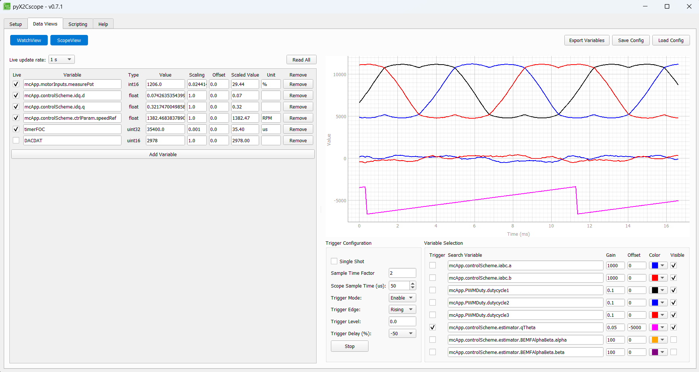

# dsPIC33AK512MC510 Sensorless FOC with 10BASE-T1S and X2Cscope

**Sensorless Field-Oriented Control (FOC) of a BLDC/PMSM motor on the MCLV-48V-300W board with real-time monitoring over a 10BASE-T1S single-pair Ethernet network.**

[](#license)


---

## Table of Contents

- [About](#about)
- [Features](#features)
- [Hardware Requirements](#hardware-requirements)
- [Software Requirements](#software-requirements)
- [Project Structure](#project-structure)
- [Architecture](#architecture)
- [Configuration](#configuration)
- [Building and Programming](#building-and-programming)
- [Running the Demo](#running-the-demo)
- [X2Cscope Usage](#x2cscope-usage)
- [Overcurrent Protection](#overcurrent-protection)
- [10BASE-T1S Network](#10base-t1s-network)
- [License](#license)
- [Contact](#contact)

---

## About

This project implements **sensorless Field-Oriented Control (FOC)** of a 3-phase BLDC/PMSM motor on the **MCLV-48V-300W** evaluation board, using the **dsPIC33AK512MC510 DIM** module as the controller. The motor targeted by default is the **ACT 57BLF02** brushless DC motor.

The FOC algorithm uses a **back-EMF PLL estimator** for sensorless rotor position and speed estimation, enabling smooth sinusoidal commutation without Hall sensors or encoders. The control loop executes at 20 kHz with a measured execution time of **~35 µs**.

A key feature of this project is the integration of the **10BASE-T1S single-pair Ethernet** interface (IEEE 802.3cg) as the sole connectivity channel. X2Cscope, a real-time software oscilloscope, communicates with the host PC **entirely over the T1S network** — eliminating the need for a separate UART or USB debug cable.

All peripheral driver code is generated by **MPLAB Code Configurator (MCC) Melody**. The FOC algorithm layer (`src/mc/`) is fully portable and hardware-independent — all hardware access is abstracted through `src/hal/mc/mc_hal.c`.

---

## Features

- **Sensorless FOC** — back-EMF PLL estimator for rotor position; Clarke/Park transforms, PI current controllers, Space Vector Modulation (SVM)
- **Startup sequence** — rotor lock → open-loop forced angle ramp → closed-loop transition with smooth RRF variable transfer
- **Speed control** — closed-loop PI speed controller with potentiometer reference and configurable ramp rates
- **Flux weakening** — feed-forward or voltage-feedback field weakening for extended speed range
- **20 kHz PWM** — three PWM generators (PG1/PG2/PG3) at 400 MHz PWM clock, 0.75 µs dead time, ~35 µs FOC execution time
- **Hardware overcurrent protection** — CMP3/DAC3 comparator with cycle-by-cycle PWM fault PCI (no software latency)
- **Software overcurrent detection** — per-cycle phase current magnitude check with configurable fault threshold
- **Smooth direction reversal** — FOC decelerates to zero speed under closed-loop control before restarting in the opposite direction
- **10BASE-T1S connectivity** — LAN8651 TC6 MAC-PHY over SPI with DMA acceleration; PLCA mode, up to 8 nodes on a single-pair bus
- **X2Cscope v3.0 over TCP/IP** — real-time variable monitoring and modification from the X2Cscope GUI, tunneled over the T1S network on TCP port 12666
- **MCC Melody abstraction** — all peripheral drivers (ADC, PWM, SPI, I2C, DMA, OPA, CMP, UART, Timer) are MCC-generated
- **Portable FOC layer** — `src/mc/` contains zero hardware dependencies; porting to another board requires only reimplementing `src/hal/mc/mc_hal.c`
- **UART debug output** — startup banner and status messages on UART1

---

## Hardware Requirements

| Component | Details |
|-----------|---------|
| Evaluation Board | [MCLV-48V-300W Motor Control Low-Voltage Evaluation Board](https://www.microchip.com/en-us/development-tool/EV18H47A) |
| Controller Module | dsPIC33AK512MC510 DIM module |
| Motor | ACT 57BLF02 BLDC motor (default) |
| T1S Connectivity | Mikroe LAN8651 10BASE-T1S Click board (plugged into XPRO1 connector) |
| Programmer/Debugger | MPLAB PKOB4 (on-board) or compatible ICD/PICkit |
| Host PC | 10BASE-T1S USB adapter or T1S-capable network interface |

**Motor Parameters** (defined in `src/mc/motor/act57blf02.h`):

| Parameter | Value |
|-----------|-------|
| Pole Pairs | 4 |
| Phase Resistance | 0.2672 Ohm |
| Phase Inductance | 135 µH |
| BEMF Constant | 6.57 mV/RPM (mechanical) |
| Nominal Speed | 3000 RPM |
| Maximum Speed | 3500 RPM |
| Rated Current | 7 A RMS |

---

## Software Requirements

| Tool | Version |
|------|---------|
| MPLAB Extension for VS Code | Latest |
| XC-DSC Compiler | 3.31.01 |
| MPLAB Code Configurator (MCC) Melody | 5.7.0 (MCC Core 5.9.0, Melody Library 2.10.1) |
| X2Cscope Library | v3.0 |
| X2Cscope GUI (host) | [pyX2Cscope](https://github.com/X2Cscope/X2Cscope_library_make/releases) or MPLAB X X2Cscope plugin |
| Device Family Pack | dsPIC33AK-MC_DFP v1.4.172 |

---

## Project Structure

| Path | Purpose |
|------|---------|
| `src/` | Application source code |
| `src/main.c` | Entry point: system init, T1S init, X2Cscope init, ADC ISR, main loop |
| `src/app.c/.h` | Button handling |
| `src/mc/` | **Portable FOC motor control** (no hardware dependencies) |
| `src/mc/mc_app.c/.h` | Motor control state machine (init, offset, run, stopping, fault) |
| `src/mc/mc_user_params.h` | Motor selection and board parameters |
| `src/mc/mc_calc_params.h` | Derived constants (PI gains, filter coefficients, timing) |
| `src/mc/foc/` | FOC algorithm: Clarke/Park, PI, SVM, PLL estimator, flux weakening |
| `src/mc/motor/` | Motor parameter header files |
| `src/mc/measure.c/.h` | Current offset calibration |
| `src/mc/fault.c/.h` | Software overcurrent detection |
| `src/hal/mc/mc_hal.c/.h` | **Hardware abstraction for motor control** (ADC, PWM, CMP3 — MCC Melody implementation) |
| `src/hal/T1S/` | T1S HAL: DMA-SPI driver and lwIP HAL bindings |
| `src/T1S/` | 10BASE-T1S application: TC6-lwIP driver, TCP server, UDP iperf client |
| `src/X2Cscope/` | X2Cscope communication layer (TCP transport shim) |
| `src/systick/` | System tick counter (TMR1, 10 µs resolution) |
| `dsPIC33AK512MC510_MCLV48V300W_T1S/mcc_generated_files/` | MCC Melody generated peripheral drivers |
| `libs/` | Pre-built static libraries (lwIP, TC6, X2Cscope) |
| `out/AK512_FOC_T1S/` | Build output: `default.elf`, `default.hex` |

---

## Architecture

```
[MCLV-48V-300W Board]
  dsPIC33AK512MC510 @ 200 MHz FCY
  |
  |-- PWM PG1/PG2/PG3 (20 kHz, 400 MHz clock) ---> 3-phase inverter (SVM)
  |-- ADC1/ADC2/ADC3 + OPA1/OPA2/OPA3 -----------> Ia, Ib, Vbus, Ibus, POT
  |-- CMP3/DAC3 (cycle-by-cycle OC) -------------> PWM Fault PCI (hardware protection)
  |-- GPIO RA12/RB6 -----------------------------> SW1/SW2 user buttons
  |-- GPIO LED1/LED2 ----------------------------> heartbeat / run state indicators
  |-- UART1 ------------------------------------> printf debug output (startup banner)
  |-- I2C3 -------------------------------------> MAC address EEPROM on T1S Click board
  |-- SPI1 + DMA0/DMA1 (~16.67 MHz) ------------> LAN8651 TC6 MAC-PHY
        |
        [10BASE-T1S single-pair bus, PLCA mode]
              |
              +-- lwIP TCP/IP stack
              |     Static IP: 192.168.0.101
              |     PLCA: node ID 2, max 8 nodes
              |
              +-- X2Cscope TCP server (port 12666)
              |     Real-time variable watch/modify from host PC GUI
              |
              +-- UDP iperf client
                    Bandwidth test to 192.168.0.5:5001
```

### FOC Control Loop (20 kHz, ~35 µs execution)

```
ADC ISR (PWM-triggered at 20 kHz)
  |
  +-- MC_HAL_MotorInputsRead()    → Read Ia, Ib, Vbus, POT from ADC
  +-- MeasureCurrentCalibrate()   → Offset correction, Ic = -(Ia+Ib)
  +-- Clarke Transform            → Ialpha, Ibeta
  +-- Park Transform              → Id, Iq (using estimated theta)
  +-- PI Controller (Id)          → Vd
  +-- PI Controller (Iq)          → Vq
  +-- Inverse Park                → Valpha, Vbeta
  +-- Inverse Clarke              → Va, Vb, Vc
  +-- Space Vector Modulation     → duty1, duty2, duty3
  +-- MC_HAL_PWMDutySet()         → Write to PG1DC/PG2DC/PG3DC
  +-- Back-EMF PLL Estimator      → theta, omega (sensorless)
  +-- Speed PI Controller         → Iq reference (closed-loop)
  +-- X2Cscope_Update()           → Snapshot variables for scope
```

### Application State Machine

```
INIT → CMD_WAIT → OFFSET → LOAD_START_READY_CHECK → RUN → STOPPING → STOP → INIT
                                                      ↓
                                                    FAULT
```

### Execution Flow

1. **Initialization** — `HAL_Init()` calls MCC `SYSTEM_Initialize()`, then `SysTick_Initialize()`, button init, UART banner
2. **Motor Control Init** — `MC_APP_Init()`: parameter config, PWM disable, CMP3/DAC3 overcurrent protection init
3. **T1S Init** — TC6 MAC-PHY reset and configuration, lwIP stack start, PLCA enable, static IP assignment
4. **X2Cscope Init** — 5000-byte scope ring buffer allocated, TCP server started on port 12666
5. **Main loop** — `X2Cscope_Communicate()`, `T1S_execute()`, button handling (start/stop/direction)
6. **ADC interrupt (20 kHz)** — FOC state machine → `X2Cscope_Update()`

---

## Configuration

Motor and control parameters are defined in `src/mc/mc_user_params.h` and `src/mc/motor/act57blf02.h`.

### Key Parameters

| Parameter | Default | Description |
|-----------|---------|-------------|
| `NOMINAL_SPEED_RPM` | 3000 | Target operating speed |
| `MAXIMUM_SPEED_RPM` | 3500 | Speed limit |
| `MINIMUM_SPEED_RPM` | 500 | Minimum speed / open-loop transition speed |
| `OPEN_LOOP_CURRENT` | 1.0 A | Forced current during open-loop startup |
| `LOCK_TIME_SEC` | 0.75 s | Rotor alignment duration |
| `OC_FAULT_LIMIT_PHASE` | 20.0 A | Software overcurrent threshold (phase) |
| `OC_FAULT_LIMIT_DCBUS` | 10.0 A | Hardware overcurrent threshold (CMP3/DAC3) |
| `FLUX_WEAKENING_VARIANT` | 2 | 0=off, 1=PI voltage feedback, 2=feed-forward |

### T1S Network Parameters

Defined in `src/T1S/t1s_lwip.c`:

| Parameter | Value |
|-----------|-------|
| IP Address | `192.168.0.101` |
| Netmask | `255.255.255.0` |
| Gateway | `192.168.0.1` |
| PLCA Node ID | 2 |
| PLCA Node Count | 8 |
| X2Cscope TCP Port | 12666 |

---

## Building and Programming

This project uses the **MPLAB Extension for VS Code** with a CMake/Ninja build system generated by MCC.

### Build

1. Open the workspace folder in VS Code with the MPLAB extension installed.
2. Select the **default** build configuration.
3. Run the build task (`Ctrl+Shift+B` → `Build`), or use the MPLAB build button in the activity bar.

The compiled output is placed in `out/AK512_FOC_T1S/default.hex`.

### Program

Connect the MCLV-48V-300W board via USB (PKOB4 on-board debugger).

Use the MPLAB extension **Program Device** action, or launch the debugger with `F5` using the provided `launch.json` configuration.

### Build Settings

| Setting | Value |
|---------|-------|
| Device | `dsPIC33AK512MC510` |
| Compiler | XC-DSC v3.31.01 |
| Optimization | `-O1` |
| Heap Size | 0 (no dynamic allocation) |
| Include Paths | `src/`, `src/hal/`, `src/mc/`, `src/T1S/inc/`, `dsPIC33AK512MC510_MCLV48V300W_T1S/` |

---

## Running the Demo

1. Connect the ACT 57BLF02 motor phase wires to the MCLV-48V-300W board (no Hall sensors needed for FOC).
2. Connect the Mikroe LAN8651 T1S Click board to the XPRO1 connector.
3. Connect a 10BASE-T1S host adapter to the single-pair bus and configure the host PC with a static IP on the `192.168.0.x` subnet.
4. Power the board and program the firmware.
5. **Start motor** — press SW1. LED2 illuminates when the motor is running.
6. **Adjust speed** — turn the potentiometer to set the speed reference (500–3500 RPM).
7. **Reverse direction** — press SW2. The motor decelerates smoothly to zero, then restarts in the opposite direction.
8. **Stop motor** — press SW1 again. The motor decelerates to zero under closed-loop control before PWM is disabled.
9. **LED1** blinks at 2 Hz as a heartbeat indicator.

### Startup Sequence

When SW1 is pressed, the FOC executes the following startup:
1. **Rotor Lock** (0.75 s) — a fixed d-axis voltage aligns the rotor to a known position
2. **Open Loop** — forced angle ramp accelerates the motor to minimum speed (500 RPM) with fixed current
3. **Closed Loop Transition** — once the PLL estimator converges, the FOC switches to sensorless closed-loop speed control

---

## X2Cscope Usage

X2Cscope provides a real-time software oscilloscope view of internal firmware variables without halting the CPU.



*pyX2Cscope showing phase currents (Ia, Ib), SVM duty cycles, estimated rotor angle (theta), and watch variables (Id, Iq, speed reference, FOC execution time, DACDAT overcurrent threshold) — all streamed in real time over the 10BASE-T1S network.*

### Scope View Channels

| Variable | Color | Description |
|----------|-------|-------------|
| `mcApp.controlScheme.iabc.a` | Blue | Phase A current |
| `mcApp.controlScheme.iabc.b` | Red | Phase B current |
| `mcApp.PWMDuty.dutycycle1` | Black | SVM duty cycle 1 |
| `mcApp.PWMDuty.dutycycle2` | Blue | SVM duty cycle 2 |
| `mcApp.PWMDuty.dutycycle3` | Red | SVM duty cycle 3 |
| `mcApp.controlScheme.estimator.qTheta` | Magenta | Estimated electrical angle (trigger source) |

### Watch View Variables

| Variable | Type | Scaling | Unit | Description |
|----------|------|---------|------|-------------|
| `mcApp.motorInputs.measurePot` | int16 | 0.0244 | % | Potentiometer position |
| `mcApp.controlScheme.idq.d` | float | 1.0 | A | Measured d-axis current |
| `mcApp.controlScheme.idq.q` | float | 1.0 | A | Measured q-axis current |
| `mcApp.controlScheme.ctrlParam.speedRef` | float | 1.0 | RPM | Speed reference |
| `timerFOC` | uint32 | 0.001 | µs | FOC loop execution time (~35 µs) |
| `DACDAT` (SFR) | uint16 | 1.0 | counts | CMP3 overcurrent DAC threshold |

### Connecting

1. Install [pyX2Cscope](https://github.com/X2Cscope/X2Cscope_library_make/releases) on the host PC.
2. Select **TCP/IP** as the transport and enter the board IP: `192.168.0.101`, port `12666`.
3. Load the firmware ELF file (`out/AK512_FOC_T1S/default.elf`) into the X2Cscope GUI to resolve variable symbols.
4. Connect and use the oscilloscope and watch views to monitor FOC variables in real time.

---

## Overcurrent Protection

The project implements two layers of overcurrent protection:

### Hardware Protection (CMP3 + PWM Fault PCI)

This is the primary protection layer with **zero software latency**. It operates entirely in hardware:

- **Comparator 3 (CMP3)** monitors the DC bus current via OPA3 output (CMP3A / RA5)
- **DAC3** provides a programmable threshold reference (`OC_FAULT_LIMIT_DCBUS` = 10 A default)
- When bus current exceeds the threshold, CMP3 output triggers the **PWM Fault PCI** on all three generators
- **Cycle-by-cycle mode**: PWM outputs are forced LOW for the remainder of the current PWM cycle only. On the next cycle, if the current has dropped below the threshold, normal operation resumes automatically
- No software intervention required — the FOC continues running while hardware silently clips overcurrent pulses

### Software Protection (fault.c)

A secondary layer that catches sustained overcurrent conditions:

- Each FOC cycle, the phase current magnitudes are checked against `OC_FAULT_LIMIT_PHASE` (20 A default)
- If any phase exceeds the limit, the application transitions to `MCAPP_FAULT` state and PWM is disabled
- Recovery requires a power cycle or debugger reset

### Testing Overcurrent via pyX2Cscope

To verify the hardware overcurrent protection is functioning:

1. Connect to the board via pyX2Cscope (TCP/IP, `192.168.0.101:12666`)
2. Start the motor (press SW1)
3. Add the SFR `DAC3DATbits.DACDAT` to the watch view (this is the overcurrent threshold in DAC counts)
4. The default value is ~2979 (corresponds to 10 A bus current)
5. **Gradually lower** the value (e.g., to 2200, then 2100, etc.)
6. Observe the phase currents (`mcApp.motorInputs.measureCurrent.Ia_actual`) — as the threshold approaches the actual bus current, the waveforms will begin to show clipping
7. At sufficiently low thresholds, the motor will stall as all PWM pulses are truncated
8. **Restore** the original value (~2979) to resume normal operation

> **Note:** The DAC reference formula is: `DACDAT = (I_limit * 2048 / 22.0) + 2048`, where 22.0 A is the full-scale current range and 2048 is the mid-scale offset.

---

## 10BASE-T1S Network

The project uses the **OpenAlliance TC6** protocol stack via Microchip's `libtc6.X.a` library and the `lwIP` TCP/IP stack (`liblwip.X.a`), communicating over SPI1 with DMA acceleration to the **LAN8651 10BASE-T1S MAC-PHY**.

- **PLCA (Physical Layer Collision Avoidance)** mode is used, providing deterministic access for up to 8 nodes on a single unshielded twisted-pair cable.
- The MAC address is read at startup from the Click board's I2C EEPROM (address `0x58`, register `0x9A`).
- A **UDP iperf client** (`src/T1S/udp_perf_client.c`) is included for network bandwidth benchmarking; it targets `192.168.0.5:5001`.

---

## License

Copyright (c) Microchip Technology Inc. All rights reserved.

Licensed under the **Apache License, Version 2.0**. See [LICENSE](LICENSE) for details.

---

## Contact

- **Team:** Motor Control and T1S Applications
- **Internal Wiki:** [Confluence - Motor Control](https://confluence.microchip.com)
- **Issue Tracker:** [Jira](https://jira.microchip.com)
