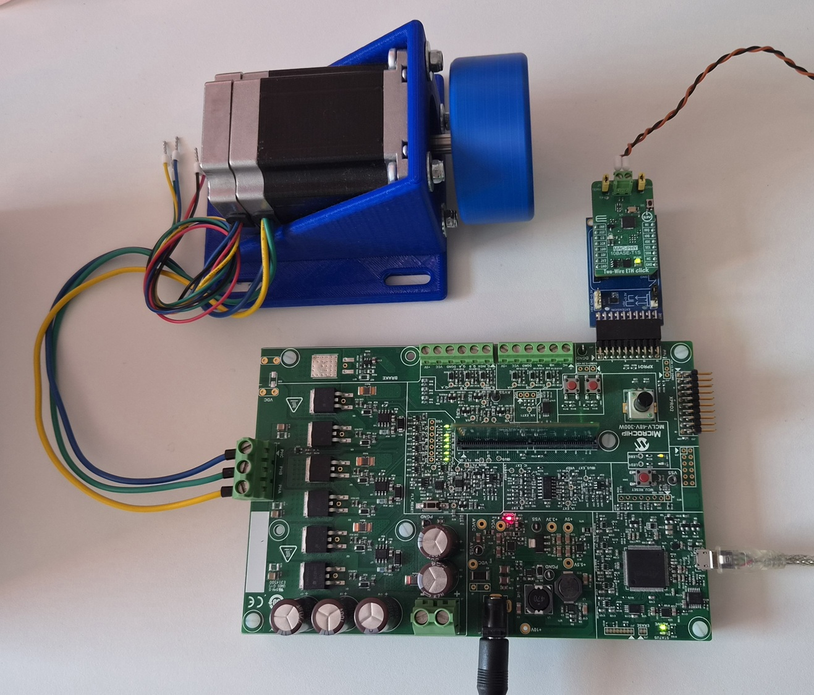
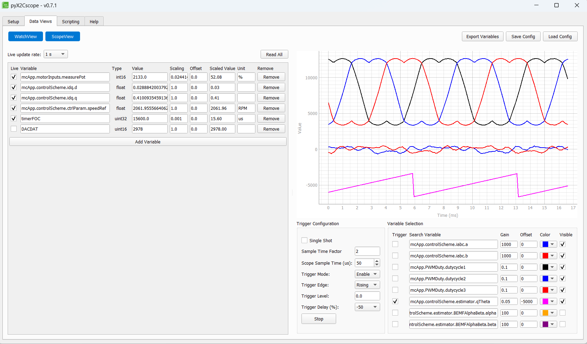
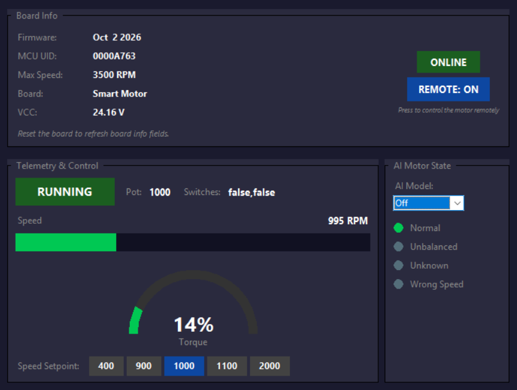

# dsPIC33AK512MC510 Sensorless FOC with 10BASE-T1S, X2Cscope + MQTT (optional)

**Sensorless Field-Oriented Control (FOC) of a BLDC/PMSM motor on the MCLV-48V-300W board with real-time monitoring over a 10BASE-T1S single-pair Ethernet network. Includes optional MQTT telemetry and remote control via a Python dashboard.**

[](#license)


---







---

## Table of Contents

- [About](#about)
- [Features](#features)
- [Hardware Requirements](#hardware-requirements)
- [Software Requirements](#software-requirements)
- [Project Structure](#project-structure)
- [Architecture](#architecture)
- [Configuration](#configuration)
- [MCC Configuration](#mcc-configuration)
- [Building and Programming](#building-and-programming)
- [Running the Demo](#running-the-demo)
- [X2Cscope Usage](#x2cscope-usage)
- [Overcurrent Protection](#overcurrent-protection)
- [MQTT Telemetry and Remote Control](#mqtt-telemetry-and-remote-control)
- [10BASE-T1S Network](#10base-t1s-network)
- [License](#license)
- [Contact](#contact)

---

## About

This project implements **sensorless Field-Oriented Control (FOC)** of a 3-phase BLDC/PMSM motor on the **MCLV-48V-300W** evaluation board, using the **dsPIC33AK512MC510 DIM** module as the controller. The motor targeted by default is the **ACT 57BLF02** brushless DC motor.

The FOC algorithm uses a **back-EMF PLL estimator** for sensorless rotor position and speed estimation, enabling smooth sinusoidal commutation without Hall sensors or encoders. The control loop executes at 20 kHz with a measured execution time of **~15.6 µs**.

A key feature of this project is the integration of the **10BASE-T1S single-pair Ethernet** interface (IEEE 802.3cg) as the sole connectivity channel. X2Cscope, a real-time software oscilloscope, communicates with the host PC **entirely over the T1S network** — eliminating the need for a separate UART or USB debug cable.

The project also includes **optional MQTT support** for publishing motor telemetry (speed, torque, VCC, etc.) and receiving remote commands (start/stop, speed setpoint) over the T1S network. A Python/Tkinter dashboard is provided for monitoring and control.

All peripheral driver code is generated by **MPLAB Code Configurator (MCC) Melody**. The FOC algorithm layer (`src/mc/`) is fully portable and hardware-independent — all hardware access is abstracted through `src/hal/mc/mc_hal.c`.

---

## Features

- **Sensorless FOC** — back-EMF PLL estimator for rotor position; Clarke/Park transforms, PI current controllers, Space Vector Modulation (SVM)
- **Startup sequence** — rotor lock → open-loop forced angle ramp → closed-loop transition with smooth RRF variable transfer
- **Speed control** — closed-loop PI speed controller with potentiometer reference and configurable ramp rates
- **Flux weakening** — feed-forward or voltage-feedback field weakening for extended speed range
- **20 kHz PWM** — three PWM generators (PG1/PG2/PG3) at 400 MHz PWM clock, 0.75 µs dead time, ~15.6 µs FOC execution time
- **Hardware overcurrent protection** — CMP3/DAC3 comparator with cycle-by-cycle PWM fault PCI (no software latency)
- **Software overcurrent detection** — per-cycle phase current magnitude check with configurable fault threshold
- **Smooth direction reversal** — FOC decelerates to zero speed under closed-loop control before restarting in the opposite direction
- **10BASE-T1S connectivity** — LAN8651 TC6 MAC-PHY over SPI with DMA acceleration; PLCA mode, up to 8 nodes on a single-pair bus
- **X2Cscope v3.0 over TCP/IP** — real-time variable monitoring and modification from the X2Cscope GUI, tunneled over the T1S network on TCP port 12666
- **MQTT telemetry and remote control (optional)** — publish motor speed, torque, VCC, and more over MQTT; remotely start/stop and set speed from a Python dashboard or Node-RED
- **MCC Melody abstraction** — all peripheral drivers (ADC, PWM, SPI, I2C, DMA, OPA, CMP, UART, Timer) are MCC-generated
- **Portable FOC layer** — `src/mc/` contains zero hardware dependencies; porting to another board requires only reimplementing `src/hal/mc/mc_hal.c`
- **UART debug output** — startup banner and status messages on UART1

---

## Hardware Requirements

| Component | Details |
|-----------|---------|
| Evaluation Board | [MCLV-48V-300W Motor Control Low-Voltage Evaluation Board](https://www.microchip.com/en-us/development-tool/EV18H47A) |
| Controller Module | dsPIC33AK512MC510 DIM module |
| Motor | ACT 57BLF02 BLDC motor (default) |
| T1S Connectivity | Mikroe LAN8651 10BASE-T1S Click board (plugged into XPRO1 connector) |
| Programmer/Debugger | MPLAB PKOB4 (on-board) or compatible ICD/PICkit |
| Host PC | [EVB-LAN8670-USB 10BASE-T1S to USB Adapter](https://www.microchip.com/en-us/development-tool/ev08l38a) (IP: 192.168.0.5) |

**Motor Parameters** (defined in `src/mc/motor/act57blf02.h`):

| Parameter | Value |
|-----------|-------|
| Pole Pairs | 4 |
| Phase Resistance | 0.2672 Ohm |
| Phase Inductance | 135 µH |
| BEMF Constant | 6.57 mV/RPM (mechanical) |
| Nominal Speed | 3000 RPM |
| Maximum Speed | 3500 RPM |
| Rated Current | 7 A RMS |

---

## Software Requirements

| Tool | Version |
|------|---------|
| MPLAB Extension for VS Code | Latest |
| XC-DSC Compiler | 3.31.01 |
| MPLAB Code Configurator (MCC) Melody | 5.7.0 (MCC Core 5.9.0, Melody Library 2.10.1) |
| X2Cscope Library | v3.0 |
| X2Cscope GUI (host) | [pyX2Cscope](https://github.com/X2Cscope/X2Cscope_library_make/releases) or MPLAB X X2Cscope plugin |
| Device Family Pack | dsPIC33AK-MC_DFP v1.4.172 |
| Mosquitto MQTT Broker (optional) | Latest — required only for MQTT telemetry and remote control |

---

## Project Structure

| Path | Purpose |
|------|---------|
| `src/` | Application source code |
| `src/main.c` | Entry point: system init, T1S init, X2Cscope init, ADC ISR, main loop |
| `src/app.c/.h` | Button handling |
| `src/mc/` | **Portable FOC motor control** (no hardware dependencies) |
| `src/mc/mc_app.c/.h` | Motor control state machine (init, offset, run, stopping, fault) |
| `src/mc/mc_user_params.h` | Motor selection and board parameters |
| `src/mc/mc_calc_params.h` | Derived constants (PI gains, filter coefficients, timing) |
| `src/mc/foc/` | FOC algorithm: Clarke/Park, PI, SVM, PLL estimator, flux weakening |
| `src/mc/motor/` | Motor parameter header files |
| `src/mc/measure.c/.h` | Current offset calibration |
| `src/mc/fault.c/.h` | Software overcurrent detection |
| `src/hal/mc/mc_hal.c/.h` | **Hardware abstraction for motor control** (ADC, PWM, CMP3 — MCC Melody implementation) |
| `src/hal/T1S/` | T1S HAL: DMA-SPI driver and lwIP HAL bindings |
| `src/T1S/` | 10BASE-T1S application: TC6-lwIP driver, TCP server, UDP iperf client |
| `src/MQTT/` | MQTT topics engine and hash table (platform-independent) |
| `src/hal/MQTT/` | Platform-specific MQTT topic definitions and callbacks |
| `src/X2Cscope/` | X2Cscope communication layer (TCP transport shim) |
| `src/systick/` | System tick counter (TMR1, 10 µs resolution) |
| `mqtt_app/` | Python MQTT dashboard (`smart_motor.py`) |
| `dsPIC33AK512MC510_MCLV48V300W_T1S/mcc_generated_files/` | MCC Melody generated peripheral drivers |
| `libs/` | Pre-built static libraries (lwIP, TC6, X2Cscope) |
| `out/AK512_FOC_T1S/` | Build output: `default.elf`, `default.hex` |

---

## Architecture

```
[MCLV-48V-300W Board]
  dsPIC33AK512MC510 @ 200 MHz FCY
  |
  |-- PWM PG1/PG2/PG3 (20 kHz, 400 MHz clock) ---> 3-phase inverter (SVM)
  |-- ADC1/ADC2/ADC3 + OPA1/OPA2/OPA3 -----------> Ia, Ib, Vbus, Ibus, POT
  |-- CMP3/DAC3 (cycle-by-cycle OC) -------------> PWM Fault PCI (hardware protection)
  |-- GPIO RA12/RB6 -----------------------------> SW1/SW2 user buttons
  |-- GPIO LED1/LED2 ----------------------------> heartbeat / run state indicators
  |-- UART1 ------------------------------------> printf debug output (startup banner)
  |-- I2C3 -------------------------------------> MAC address EEPROM on T1S Click board
  |-- SPI1 + DMA0/DMA1 (20 MHz) ------------> LAN8651 TC6 MAC-PHY
        |
        [10BASE-T1S single-pair bus, PLCA mode]
              |
              +-- lwIP TCP/IP stack
              |     Static IP: 192.168.0.100
              |     PLCA: node ID 2, max 8 nodes
              |
              +-- X2Cscope TCP server (port 12666)
              |     Real-time variable watch/modify from host PC GUI
              |
              +-- MQTT client (optional)
              |     Publish telemetry / subscribe to remote commands
              |
              +-- UDP iperf client
                    Bandwidth test to 192.168.0.5:5001
```

### FOC Control Loop (20 kHz, ~15.6 µs execution)

```
ADC ISR (PWM-triggered at 20 kHz)
  |
  +-- MC_HAL_MotorInputsRead()    → Read Ia, Ib, Vbus, POT from ADC
  +-- MeasureCurrentCalibrate()   → Offset correction, Ic = -(Ia+Ib)
  +-- Clarke Transform            → Ialpha, Ibeta
  +-- Park Transform              → Id, Iq (using estimated theta)
  +-- PI Controller (Id)          → Vd
  +-- PI Controller (Iq)          → Vq
  +-- Inverse Park                → Valpha, Vbeta
  +-- Inverse Clarke              → Va, Vb, Vc
  +-- Space Vector Modulation     → duty1, duty2, duty3
  +-- MC_HAL_PWMDutySet()         → Write to PG1DC/PG2DC/PG3DC
  +-- Back-EMF PLL Estimator      → theta, omega (sensorless)
  +-- Speed PI Controller         → Iq reference (closed-loop)
  +-- X2Cscope_Update()           → Snapshot variables for scope
```

### Application State Machine

```
INIT → CMD_WAIT → OFFSET → LOAD_START_READY_CHECK → RUN → STOPPING → STOP → INIT
                                                      ↓
                                                    FAULT
```

### Execution Flow

1. **Initialization** — `HAL_Init()` calls MCC `SYSTEM_Initialize()`, then `SysTick_Initialize()`, button init, UART banner
2. **Motor Control Init** — `MC_APP_Init()`: parameter config, PWM disable, CMP3/DAC3 overcurrent protection init
3. **T1S Init** — TC6 MAC-PHY reset and configuration, lwIP stack start, PLCA enable, static IP assignment
4. **X2Cscope Init** — 5000-byte scope ring buffer allocated, TCP server started on port 12666
5. **MQTT Topics Init** — register publish/subscribe topics (when `MQTT_ENABLED`)
6. **Main loop** — `X2Cscope_Communicate()`, `T1S_execute()`, button handling, MQTT publish cycle (every 250 ms)
7. **ADC interrupt (20 kHz)** — FOC state machine → `X2Cscope_Update()`

---

## Configuration

Motor and control parameters are defined in `src/mc/mc_user_params.h` and `src/mc/motor/act57blf02.h`.

### Key Parameters

| Parameter | Default | Description |
|-----------|---------|-------------|
| `NOMINAL_SPEED_RPM` | 3000 | Target operating speed |
| `MAXIMUM_SPEED_RPM` | 3500 | Speed limit |
| `MINIMUM_SPEED_RPM` | 500 | Minimum speed / open-loop transition speed |
| `OPEN_LOOP_CURRENT` | 1.0 A | Forced current during open-loop startup |
| `LOCK_TIME_SEC` | 0.75 s | Rotor alignment duration |
| `OC_FAULT_LIMIT_PHASE` | 20.0 A | Software overcurrent threshold (phase) |
| `OC_FAULT_LIMIT_DCBUS` | 10.0 A | Hardware overcurrent threshold (CMP3/DAC3) |
| `FLUX_WEAKENING_VARIANT` | 2 | 0=off, 1=PI voltage feedback, 2=feed-forward |

### T1S Network Parameters

Defined in `src/T1S/t1s_lwip.c`:

| Parameter | Value |
|-----------|-------|
| IP Address | `192.168.0.100` |
| Netmask | `255.255.255.0` |
| Gateway | `192.168.0.1` |
| PLCA Node ID | 2 |
| PLCA Node Count | 8 |
| X2Cscope TCP Port | 12666 |

---

## MCC Configuration

All peripherals are configured using **MPLAB Code Configurator (MCC) Melody**. The MCC project file is located at `dsPIC33AK512MC510_MCLV48V300W_T1S/mcc/dspic33ak512_t1s.mc3`. Generated driver source files are in `dsPIC33AK512MC510_MCLV48V300W_T1S/mcc_generated_files/` and should never be edited manually — regenerate from MCC instead.

Configured peripherals include: PWM (PG1/PG2/PG3), ADC (ADC1/ADC2/ADC3), OPA (OPA1/OPA2/OPA3), CMP3/DAC3, SPI1, DMA (DMA0/DMA1), I2C3, UART1, TMR1, and SCCP1.

For detailed MCC screenshots and per-peripheral configuration, see [mcc_config.md](mcc_config.md).

---

## Building and Programming

This project uses the **MPLAB Extension for VS Code** with a CMake/Ninja build system generated by MCC.

### Build

1. Open the workspace folder in VS Code with the MPLAB extension installed.
2. Select the **default** build configuration.
3. Run the build task (`Ctrl+Shift+B` → `Build`), or use the MPLAB build button in the activity bar.

The compiled output is placed in `out/AK512_FOC_T1S/default.hex`.

### Program

Connect the MCLV-48V-300W board via USB (PKOB4 on-board debugger).

Use the MPLAB extension **Program Device** action, or launch the debugger with `F5` using the provided `launch.json` configuration.

### Build Settings

| Setting | Value |
|---------|-------|
| Device | `dsPIC33AK512MC510` |
| Compiler | XC-DSC v3.31.01 |
| Optimization | `-O3` |
| Include Paths | `src/`, `src/hal/`, `src/mc/`, `src/T1S/inc/`, `dsPIC33AK512MC510_MCLV48V300W_T1S/` |

### MQTT Build Configuration

MQTT support is controlled by two settings that must be changed together:

| Configuration | `src/hal/hal.h` | `.vscode/AK512_FOC_T1S.mplab.json` |
|---------------|-----------------|-------------------------------------|
| **With MQTT** | `#define MQTT_ENABLED` | `"linker.heap-size": "4096"` |
| **Without MQTT** | `#undef MQTT_ENABLED` | `"linker.heap-size": "0"` |

When MQTT is disabled, the linker automatically strips all MQTT code (`--gc-sections`). The heap is only needed for the MQTT topic hash table; lwIP uses its own internal memory pool.

### Memory Usage

| Region | With MQTT | Without MQTT | Total |
|--------|-----------|--------------|-------|
| Program (Flash) | 149,900 bytes (28%) | 125,632 bytes (24%) | 524,284 bytes |
| Data (RAM) | 31,684 bytes (48%) | 27,328 bytes (42%) | 65,536 bytes |
| Heap | 4,096 bytes | 0 bytes | — |

---

## Running the Demo

1. Connect the ACT 57BLF02 motor phase wires to the MCLV-48V-300W board (no Hall sensors needed for FOC).
2. Connect the Mikroe LAN8651 T1S Click board to the XPRO1 connector.
3. Connect a 10BASE-T1S host adapter to the single-pair bus and configure the host PC with a static IP on the `192.168.0.x` subnet.
4. Power the board and program the firmware.
5. **Start motor** — press SW1. LED2 illuminates when the motor is running.
6. **Adjust speed** — turn the potentiometer to set the speed reference (500–3500 RPM).
7. **Reverse direction** — press SW2. The motor decelerates smoothly to zero, then restarts in the opposite direction.
8. **Stop motor** — press SW1 again. The motor decelerates to zero under closed-loop control before PWM is disabled.
9. **LED1** blinks at 2 Hz as a heartbeat indicator.

### Startup Sequence

When SW1 is pressed, the FOC executes the following startup:
1. **Rotor Lock** (0.75 s) — a fixed d-axis voltage aligns the rotor to a known position
2. **Open Loop** — forced angle ramp accelerates the motor to minimum speed (500 RPM) with fixed current
3. **Closed Loop Transition** — once the PLL estimator converges, the FOC switches to sensorless closed-loop speed control

---

## X2Cscope Usage

X2Cscope provides a real-time software oscilloscope view of internal firmware variables without halting the CPU.


*pyX2Cscope showing phase currents (Ia, Ib), SVM duty cycles, estimated rotor angle (theta), and watch variables (Id, Iq, speed reference, FOC execution time, DACDAT overcurrent threshold) — all streamed in real time over the 10BASE-T1S network.*

### Installation

If pyX2Cscope is not installed, run the provided script to get the latest version:

```bash
get_pyx2cscope.bat
```

### Connecting

1. Launch pyX2Cscope on the host PC.
2. Select **TCP/IP** as the transport and enter the board IP: `192.168.0.100`, port `12666`.
3. Load the firmware ELF file (`out/AK512_FOC_T1S/default.elf`) into the X2Cscope GUI to resolve variable symbols.
4. Connect and go to **Data Views**, then press **Load Config** to load `pyX2Cscope_config.json` from this repository. It will load the default scope and watch variables.
5. Use the oscilloscope and watch views to monitor FOC variables in real time.

### Scope View Channels

| Variable | Color | Description |
|----------|-------|-------------|
| `mcApp.controlScheme.iabc.a` | Blue | Phase A current |
| `mcApp.controlScheme.iabc.b` | Red | Phase B current |
| `mcApp.PWMDuty.dutycycle1` | Black | SVM duty cycle 1 |
| `mcApp.PWMDuty.dutycycle2` | Blue | SVM duty cycle 2 |
| `mcApp.PWMDuty.dutycycle3` | Red | SVM duty cycle 3 |
| `mcApp.controlScheme.estimator.qTheta` | Magenta | Estimated electrical angle (trigger source) |

### Watch View Variables

| Variable | Type | Scaling | Unit | Description |
|----------|------|---------|------|-------------|
| `mcApp.motorInputs.measurePot` | int16 | 0.0244 | % | Potentiometer position |
| `mcApp.controlScheme.idq.d` | float | 1.0 | A | Measured d-axis current |
| `mcApp.controlScheme.idq.q` | float | 1.0 | A | Measured q-axis current |
| `mcApp.controlScheme.ctrlParam.speedRef` | float | 1.0 | RPM | Speed reference |
| `timerFOC` | uint32 | 0.001 | µs | FOC loop execution time (~15.6 µs) |
| `DACDAT` (SFR) | uint16 | 1.0 | counts | CMP3 overcurrent DAC threshold |

---

## Overcurrent Protection

The project implements two layers of overcurrent protection:

### Hardware Protection (CMP3 + PWM Fault PCI)

This is the primary protection layer with **zero software latency**. It operates entirely in hardware:

- **Comparator 3 (CMP3)** monitors the DC bus current via OPA3 output (CMP3A / RA5)
- **DAC3** provides a programmable threshold reference (default: 2900 counts, valid range: 0–3890). The threshold can be adjusted at runtime via X2Cscope by writing `DAC3DATbits.DACDAT`
- When bus current exceeds the threshold, CMP3 output triggers the **PWM Fault PCI** on all three generators
- **Cycle-by-cycle mode**: PWM outputs are forced LOW for the remainder of the current PWM cycle only. On the next cycle, if the current has dropped below the threshold, normal operation resumes automatically
- No software intervention required — the FOC continues running while hardware silently clips overcurrent pulses

### Software Protection (fault.c)

A secondary layer that catches sustained overcurrent conditions:

- Each FOC cycle, the phase current magnitudes are checked against `OC_FAULT_LIMIT_PHASE` (20 A default)
- If any phase exceeds the limit, the application transitions to `MCAPP_FAULT` state and PWM is disabled
- Recovery requires a power cycle or debugger reset

### Stall Detection and Recovery

When the overcurrent threshold is set low enough that the motor cannot develop sufficient torque, or when the rotor is mechanically blocked, the sensorless estimator loses angle tracking. Without countermeasures, the FOC would apply torque in random directions causing severe vibration.

The firmware implements automatic stall detection and recovery:

1. **Closed-loop stall detection** — If the estimated speed drops below 200 RPM while the target speed is above 200 RPM for longer than 200 ms, the FOC declares a stall and restarts from rotor lock
2. **Open-loop timeout** — If the open-loop startup phase does not achieve closed-loop transition within 1.0 s, the FOC restarts from rotor lock
3. **Automatic retry** — The lock → open-loop → closed-loop sequence repeats until conditions allow the motor to spin (e.g., overcurrent threshold raised, mechanical blockage removed)

During the rotor lock phase, d-axis voltage holds the rotor at a known position without vibration. During open-loop, a forced angle drives the motor at a deterministic rate. The retry loop ensures the motor resumes as soon as the constraint is lifted.

Stall parameters are defined in `src/mc/motor/act57blf02.h`:

| Parameter | Default | Description |
|-----------|---------|-------------|
| `STALL_SPEED_THRESHOLD_RPM` | 200 RPM | Speed below which the motor is considered stalled |
| `STALL_DETECT_TIME_SEC` | 0.200 s | Time before declaring stall in closed-loop |
| `OL_TIMEOUT_SEC` | 1.000 s | Maximum time in open-loop before retry |

### Testing Overcurrent via pyX2Cscope

To verify the hardware overcurrent protection is functioning:

1. Connect to the board via pyX2Cscope (TCP/IP, `192.168.0.100:12666`)
2. Start the motor (press SW1)
3. Add the SFR `DAC3DATbits.DACDAT` to the watch view (this is the overcurrent threshold in DAC counts)
4. The default value is **2900** (configured in MCC). The DAC valid range is **0–3890** (0x000–0xF32)
5. **Gradually lower** the value (e.g., to 2200, then 2100, etc.)
6. Observe the phase currents (`mcApp.motorInputs.measureCurrent.Ia_actual`) — as the threshold approaches the actual bus current, the waveforms will begin to show clipping
7. At sufficiently low thresholds, the motor will stall as all PWM pulses are truncated. The stall recovery mechanism will automatically retry the startup sequence
8. **Restore** the original value (2900) — the motor will resume spinning on the next retry cycle
9. To effectively **disable** overcurrent protection, set `DACDAT` to 3890 (maximum). The threshold becomes unreachable and cycle-by-cycle limiting stops

> **Note:** The DAC reference formula is: `DACDAT = (I_limit * 2048 / 22.0) + 2048`, where 22.0 A is the full-scale current range and 2048 is the mid-scale offset. The hardware maximum is 3890 counts (0xF32).

---

## MQTT Telemetry and Remote Control

The firmware includes an optional MQTT client built on top of the lwIP TCP/IP stack. When enabled (`MQTT_ENABLED`), the board connects to an MQTT broker at `192.168.0.5` (the host PC connected via the EVB-LAN8670-USB adapter) and publishes motor telemetry while subscribing to remote control commands — all over the same 10BASE-T1S network used by X2Cscope. The broker address is defined in `src/MQTT/mqtt_topics.c`.

### How It Works

On connection to the broker, the firmware publishes one-time board information (firmware version, MCU UID, max speed, board name) and then periodically publishes live telemetry every 250 ms:

| Published Topic | Description |
|-----------------|-------------|
| `smart_motor/speed` | Motor speed in RPM |
| `smart_motor/torque` | Motor torque (Iq current) |
| `smart_motor/vcc` | DC bus voltage |
| `smart_motor/on` | Motor running state (`true`/`false`) |
| `smart_motor/pot` | Potentiometer value |
| `smart_motor/firmware` | Firmware build date |
| `smart_motor/mcu_uid` | MCU device ID |
| `smart_motor/max_speed` | Maximum configured speed |

The firmware also subscribes to remote control topics:

| Subscribed Topic | Description |
|------------------|-------------|
| `smart_motor/remote_control` | Enable/disable remote control (`true`/`false`) |
| `smart_motor/on` | Start/stop motor (when remote enabled) |
| `smart_motor/speed_setpoint` | Set speed in RPM (when remote enabled) |
| `smart_motor/led` | Control LED1 (`true`/`false`) |
| `smart_motor/aiml_mode` | AI/ML analysis mode (`0`=off, `1`=Model #1) |

When **remote control** is enabled, the board ignores local button presses and potentiometer input — speed and start/stop are controlled entirely by the MQTT broker.

### Prerequisites

Install **Mosquitto** MQTT broker on the host PC (or a Raspberry Pi on the T1S network). Enable external connections in `mosquitto.conf`:

```
listener 1883
allow_anonymous true
```

Restart the Mosquitto service after editing the configuration.

### Python Dashboard

A Python/Tkinter dashboard is provided in `mqtt_app/smart_motor.py` for monitoring and controlling the motor.


The dashboard displays real-time telemetry (speed bar, torque gauge, VCC, board info, online status) and provides controls for remote operation (start/stop, speed setpoint buttons, AI model selector). Failure state LEDs indicate motor health (Normal, Unbalanced, Unknown, Wrong Speed).

### Running the Dashboard

```bash
cd mqtt_app
python -m venv venv
venv\Scripts\activate        # Windows
# source venv/bin/activate   # Linux/macOS
pip install -r requirements.txt
python smart_motor.py [broker_ip]
```

`broker_ip` defaults to `192.168.0.5`. Pass the IP of the machine running Mosquitto.

---

## 10BASE-T1S Network

The project uses the **OpenAlliance TC6** protocol stack via Microchip's `libtc6.X.a` library and the `lwIP` TCP/IP stack (`liblwip.X.a`), communicating over SPI1 with DMA acceleration to the **LAN8651 10BASE-T1S MAC-PHY**.

- **PLCA (Physical Layer Collision Avoidance)** mode is used, providing deterministic access for up to 8 nodes on a single unshielded twisted-pair cable.
- The MAC address is read at startup from the Click board's I2C EEPROM (address `0x58`, register `0x9A`).
- A **UDP iperf client** (`src/T1S/udp_perf_client.c`) is included for network bandwidth benchmarking; it targets `192.168.0.5:5001`.

---

## License

Copyright (c) Microchip Technology Inc. All rights reserved.

Licensed under the **Apache License, Version 2.0**. See [LICENSE](LICENSE) for details.

---

## Contact

- **Team:** Motor Control and T1S Applications
- **Internal Wiki:** [Confluence - Motor Control](https://confluence.microchip.com)
- **Issue Tracker:** [Jira](https://jira.microchip.com)
